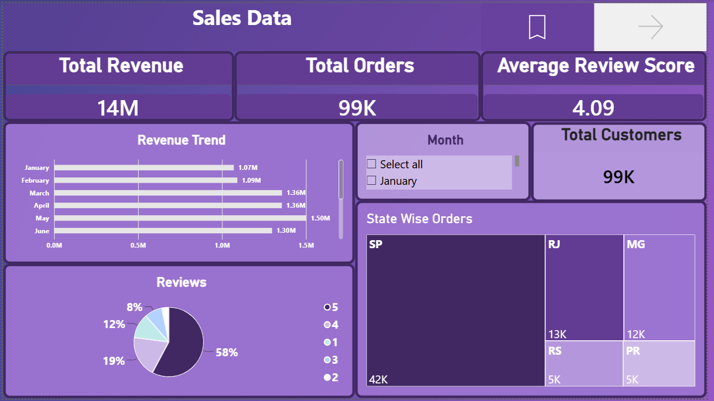
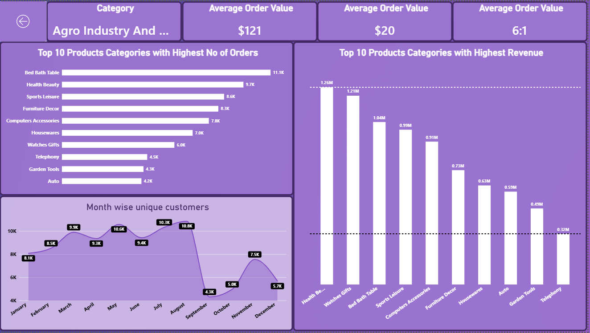

# Olist E-Commerce Data Analysis & Power BI Dashboard

An end-to-end e-commerce data analysis project using **SQL and Power BI** to investigate sales performance, product categories, customers, sellers, geographic demand, revenue, and customer reviews.

## Project Overview

This project analyzes the **Olist Brazilian E-Commerce Public Dataset**, a relational dataset containing information about orders placed through the Olist marketplace.

The project combines SQL-based analysis with an interactive Power BI dashboard to answer practical business questions and convert raw e-commerce data into actionable insights.

### Key areas analyzed

* Sales and revenue performance
* Product category performance
* Order-item volume
* Customer distribution
* Geographic demand
* Seller performance
* Product pricing
* Customer reviews
* Monthly customer activity

---

# Business Questions

The analysis was designed around practical business questions:

1. Which product categories have the highest average item prices?
2. Which product categories have the highest order-item volume?
3. Which Brazilian states have the largest customer bases and highest order volumes?
4. Which sellers generate the highest item revenue?
5. How do top sellers compare in terms of average price and customer review score?
6. Which customers have the highest average purchase price?
7. How does revenue change over time?
8. Which product categories contribute the most revenue?
9. How does customer activity change throughout the year?

---

# Tools & Technologies

| Tool            | Purpose                                                 |
| --------------- | ------------------------------------------------------- |
| **SQL**         | Data querying, aggregation, joins and business analysis |
| **Power BI**    | Interactive dashboard and data visualization            |
| **Power Query** | Data preparation and transformation                     |
| **DAX**         | Calculated measures and KPIs                            |
| **Excel**       | Supporting data analysis                                |
| **GitHub**      | Project documentation and portfolio presentation        |

---

# Dataset

The project uses the **Olist Brazilian E-Commerce Public Dataset**.

The dataset contains multiple related tables covering different parts of the e-commerce operation, including:

* Customers
* Orders
* Order Items
* Products
* Sellers
* Order Reviews
* Geolocation

The relational structure of the dataset makes it suitable for practicing SQL joins and multi-table business analysis.

---

# SQL Analysis

## 1. Top Product Categories by Average Item Price

**File:** `sql/01_top_categories_by_average_price.sql`

### Business Question

Which product categories have the highest average item prices?

### Why It Matters

Average item price helps identify higher-value product categories and provides insight into the marketplace's product mix.

This type of analysis can support:

* Pricing analysis
* Category strategy
* Product positioning
* Revenue planning

### Approach

The query joins `olist_order_items` with `olist_products` using `product_id`.

The analysis:

1. Groups products by category.
2. Calculates the average item price.
3. Sorts categories from highest to lowest.
4. Returns the top 10 categories.

### SQL Concepts

* `JOIN`
* `AVG()`
* `GROUP BY`
* `ORDER BY`
* `LIMIT`
* `WHERE`
* Aliases
* Rounding

---

## 2. Top Product Categories by Order-Item Volume

**File:** `sql/02_top_categories_by_order_items.sql`

### Business Question

Which product categories have the highest order-item volume?

### Why It Matters

High order-item volume indicates strong demand for a category.

Comparing order-item volume with revenue is particularly useful because a category with many purchases is not necessarily the category generating the most revenue.

### Approach

The query joins products to order items, groups the data by product category, and counts order-item records.

### SQL Concepts

* `JOIN`
* `COUNT()`
* `GROUP BY`
* `ORDER BY`
* `LIMIT`
* Filtering null categories

### Important Metric Definition

This analysis counts **order-item records**, not distinct orders.

One customer order can contain multiple products, so one order can produce multiple order-item records.

---

## 3. Top Brazilian States by Customers and Orders

**File:** `sql/03_top_states_by_customers_and_orders.sql`

### Business Question

Which Brazilian states have the largest customer bases and highest order volumes?

### Why It Matters

Geographic demand analysis can support:

* Regional marketing
* Logistics planning
* Seller acquisition
* Market expansion
* Resource allocation

### Approach

Customers are joined directly to orders using `customer_id`.

The analysis calculates:

* Unique customers by state
* Unique orders by state

The results are ranked according to order volume.

### SQL Concepts

* Multi-table `JOIN`
* `COUNT(DISTINCT ...)`
* `GROUP BY`
* `ORDER BY`
* `LIMIT`

### Data Quality Consideration

The original exploratory analysis included a customer-to-geolocation join using state information.

Because the geolocation table contains multiple records for a state, such a join can multiply records and inflate customer or order counts.

The portfolio version therefore uses the direct `customers → orders` relationship for these metrics.

---

## 4. Top Sellers by Item Revenue

**File:** `sql/04_top_sellers_by_revenue.sql`

### Business Question

Which sellers generate the highest item revenue, and how do their average prices and review scores compare?

### Why It Matters

Seller-level analysis helps identify high-performing marketplace sellers and provides a basis for investigating relationships between:

* Revenue
* Pricing
* Customer satisfaction

### Metrics

The query calculates:

* Total item revenue
* Average item price
* Average review score

### SQL Concepts

* Multiple-table `JOIN`
* `SUM()`
* `AVG()`
* `GROUP BY`
* `ORDER BY`
* `LIMIT`
* Aliases
* Rounding

### Important Metric Definition

`total_item_revenue` is calculated using the `price` field from `olist_order_items`.

Freight charges are not included in this metric.

---

## 5. High-Value Customer Analysis

**File:** `sql/05_high_value_customers.sql`

### Business Question

Which customers have the highest average item price across their purchases?

### Why It Matters

Customers have different purchasing patterns and price levels.

Identifying customers associated with higher-value purchases can provide a starting point for:

* Customer segmentation
* High-value customer analysis
* Purchasing behavior analysis
* Future Customer Lifetime Value analysis

### Metrics

For each customer, the query calculates:

* Number of order-item records
* Average item price

### SQL Concepts

* Multi-table `JOIN`
* `COUNT()`
* `AVG()`
* `GROUP BY`
* `ORDER BY`
* `LIMIT`

### Important Metric Definition

This analysis ranks customers by **average item price**.

It is not a Customer Lifetime Value calculation and does not represent total revenue generated by each customer.

---

# Power BI Dashboard

The SQL analysis was complemented by an interactive Power BI dashboard.

## Dashboard Page 1 — Sales Overview

The first dashboard page provides a high-level view of marketplace performance.

### KPIs

* **Total Revenue:** 14M
* **Total Orders:** 99K
* **Average Review Score:** 4.09
* **Total Customers:** 99K

### Revenue Trend

The revenue trend visual shows monthly revenue performance and allows users to identify changes in sales over time.

### State-Wise Orders

A treemap visualizes order distribution across Brazilian states.

This makes it possible to quickly identify the geographic markets generating the largest number of orders.

### Monthly Filter

A month slicer allows users to investigate specific periods and analyze the dashboard dynamically.

### Revenue Distribution

A category distribution visual provides an overview of the selected revenue mix.

---

# Dashboard Page 2 — Category & Customer Analysis

The second dashboard page focuses on product categories, revenue and customer activity.

## Top 10 Categories by Order Volume

The dashboard ranks the product categories with the highest order-item volumes.

The analysis includes categories such as:

* Bed Bath Table
* Health Beauty
* Sports Leisure
* Furniture Decor
* Computers Accessories
* Housewares
* Watches Gifts
* Telephony
* Garden Tools
* Auto

## Top 10 Categories by Revenue

The dashboard separately ranks product categories according to revenue contribution.

This allows comparison between:

**Order Volume vs. Revenue**

This distinction is important because a category can generate many orders while another category generates more revenue due to higher prices.

## Monthly Unique Customers

The dashboard tracks unique customers across months.

This helps identify:

* High-activity periods
* Low-activity periods
* Changes in marketplace engagement
* Potential seasonal patterns

## Category-Level Analysis

The dashboard includes dynamic category selection and category-level KPIs.

Users can select a category and investigate its performance without leaving the dashboard.

---

# Dashboard Preview

## Sales Overview



## Category & Customer Analysis



---

# Key Analytical Insights

## Revenue and Order Volume Measure Different Things

The project separates category demand from financial contribution.

A category with the highest number of order items is not necessarily the category generating the highest revenue.

This provides a more useful view of category performance than looking at order volume alone.

## Geographic Demand Is Concentrated

The state-level analysis shows that Olist marketplace activity is concentrated in particular Brazilian states, with São Paulo representing a particularly large share of orders.

This can be useful for understanding geographic demand and potential logistics or marketing priorities.

## Customer Activity Changes Over Time

The monthly unique-customer analysis shows variation in marketplace activity throughout the year.

This creates opportunities for further investigation into seasonality and customer engagement.

## Seller Performance Varies

Seller revenue is not evenly distributed.

The seller analysis provides a starting point for understanding which sellers contribute the most item revenue and how their pricing and review scores compare.

---

# Analytical Workflow

```text
Raw Olist Dataset
        |
        v
Data Preparation
        |
        v
SQL Analysis
        |
        v
Business Questions
        |
        v
Aggregations & KPIs
        |
        v
Power BI Data Model
        |
        v
DAX Measures
        |
        v
Interactive Dashboard
        |
        v
Business Insights
```

---

# SQL Skills Demonstrated

This project demonstrates practical SQL skills including:

* Relational data analysis
* `INNER JOIN`
* Multi-table joins
* `COUNT()`
* `COUNT(DISTINCT ...)`
* `SUM()`
* `AVG()`
* `GROUP BY`
* `ORDER BY`
* `LIMIT`
* Filtering
* Column aliases
* Numeric rounding
* Business-oriented aggregation

---

# Power BI Skills Demonstrated

* Data preparation
* Power Query
* Data modeling
* DAX measures
* KPI cards
* Slicers
* Interactive filtering
* Drill-through analysis
* Treemaps
* Bar charts
* Line charts
* Category analysis
* Geographic analysis
* Dashboard design
* Business-focused data visualization

---

# Business Analytics Skills Demonstrated

* Translating business questions into analytical queries
* Data aggregation
* KPI development
* Comparative analysis
* Customer analysis
* Product analysis
* Seller analysis
* Geographic analysis
* Revenue analysis
* Trend analysis
* Data storytelling

---

# Project Limitations

This project is primarily focused on descriptive and diagnostic analysis.

It does not currently include:

* Sales forecasting
* Machine learning
* Predictive modeling
* Customer Lifetime Value modeling
* Predictive customer segmentation
* Causal inference

The SQL analysis primarily focuses on relational querying and aggregation.

---

# Future Improvements

Potential extensions include:

1. Add SQL CTE-based analytical queries.
2. Add SQL window functions for ranking and period comparisons.
3. Analyze delivery delays against estimated delivery dates.
4. Analyze freight cost as a percentage of order value.
5. Analyze review scores by product category.
6. Analyze repeat-purchase behavior.
7. Build customer segmentation.
8. Calculate Customer Lifetime Value.
9. Analyze seller performance over time.
10. Add year-over-year revenue analysis.
11. Recreate selected analyses in Python using Pandas.
12. Add more advanced Power BI drill-through and tooltip analysis.

---

# Conclusion

This project demonstrates an end-to-end approach to e-commerce data analysis using SQL and Power BI.

SQL was used to investigate business questions across multiple related tables, while Power BI was used to transform the analysis into an interactive dashboard.

The project demonstrates the practical application of:

**SQL → Data Analysis → KPI Development → Power BI → Business Insights**

It represents an entry-level Data Analyst portfolio project focused on turning relational e-commerce data into useful business information.
